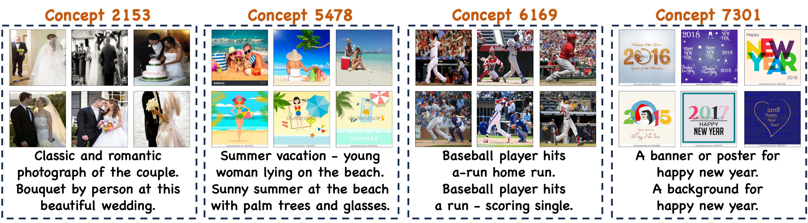
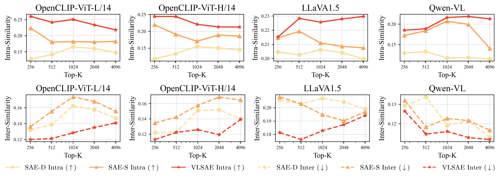
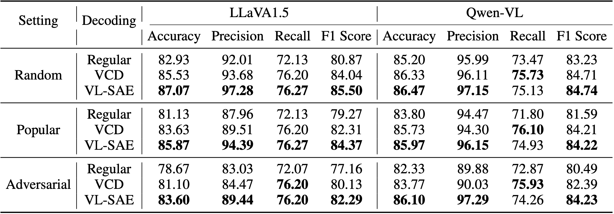
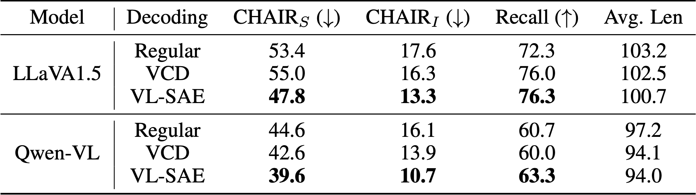

# [NeurIPS 2025] VL-SAE: Interpreting and Enhancing Vision-Language Alignment with a Unified Concept Set

This repository is the official implementation of [VL-SAE](https://arxiv.org/abs/2510.21323), which helps users to understand the vision-language alignment of VLMs via concepts.

## Requirements

Create a conda virtual environment and activate it:

```bash
conda create -n vlsae python=3.8 -y
conda activate vlsae
```

Install dependencies:

```
pip install -r requirements.txt
```

## Dataset preparation

Install CC3M dataset from [cc3m-wds](https://huggingface.co/datasets/pixparse/cc3m-wds), and put it under ``./CC3M``

Running the provided scripts to preprocess the dataset:

``` bash
bash cc3m_untar.sh
python cc3m_moving.py
python cc3m_meta.py
```

## Quick Start

Download LLaVA 1.5 and put it under ``./lvlms/pretrained_models``

For OpenCLIP-ViT-B/32, download the pre-trained VL-SAE weights ([SAE weights](https://www.modelscope.cn/models/ssfgunner/VL-SAE/resolve/master/OpenCLIP-ViT-B-32/openclip_ViT-B-32_VL_SAE_256_8_best.pth), [metadata](https://www.modelscope.cn/models/ssfgunner/VL-SAE/resolve/master/OpenCLIP-ViT-B-32/c2d_openclip_ViT-B-32_256_8.json)) and put it under ``cvlms/demo``.

For LLaVA 1.5, download the the pre-trained VL-SAE ([SAE weights](https://www.modelscope.cn/models/ssfgunner/VL-SAE/resolve/master/llava1.5/llava_256_8_best.pth), [Auxiliary AE weights](https://www.modelscope.cn/models/ssfgunner/VL-SAE/resolve/master/llava1.5/llava_aux_best.pt), [metadata](https://www.modelscope.cn/models/ssfgunner/VL-SAE/resolve/master/llava1.5/c2d_llava_256_8.json)) and put it under ``lvlms/demo``.

We present the demo of VL-SAE with OpenCLIP and LLaVA 1.5 in ``cvlms/demo/demo.ipynb`` and ``lvlms/demo/demo.ipynb``, respectively.

Moreover, we provide scripts ``lvlms/demo/demo_inference.ipynb`` that incorporate the VL-SAE to modify the representations during the inference process of LVLMs.

## Pre-trained Models

The pre-trained VL-SAE is provided in [ModelScope](https://www.modelscope.cn/models/ssfgunner/VL-SAE/) and [HuggingFace](https://huggingface.co/shufanshen/VL-SAE).

| Base Model        | ModelScope                                                   | HuggingFace                                                  |
| ----------------- | ------------------------------------------------------------ | ------------------------------------------------------------ |
| OpenCLIP-ViT-B/32 | [SAE weights](https://www.modelscope.cn/models/ssfgunner/VL-SAE/resolve/master/OpenCLIP-ViT-B-32/openclip_ViT-B-32_VL_SAE_256_8_best.pth), [metadata](https://www.modelscope.cn/models/ssfgunner/VL-SAE/resolve/master/OpenCLIP-ViT-B-32/c2d_openclip_ViT-B-32_256_8.json) | [SAE weights](https://huggingface.co/shufanshen/VL-SAE/resolve/main/OpenCLIP-ViT-B-32/openclip_ViT-B-32_VL_SAE_256_8_best.pth?download=true), [metadata](https://huggingface.co/shufanshen/VL-SAE/resolve/main/OpenCLIP-ViT-B-32/c2d_openclip_ViT-B-32_256_8.json?download=true) |
| OpenCLIP-ViT-B/16 | [SAE weights](https://www.modelscope.cn/models/ssfgunner/VL-SAE/resolve/master/OpenCLIP-ViT-B-16/openclip_ViT-B-16_VL_SAE_256_8_best.pth), [metadata](https://www.modelscope.cn/models/ssfgunner/VL-SAE/resolve/master/OpenCLIP-ViT-B-16/c2d_openclip_ViT-B-16_256_8.json) | [SAE weights](https://huggingface.co/shufanshen/VL-SAE/resolve/main/OpenCLIP-ViT-B-16/openclip_ViT-B-16_VL_SAE_256_8_best.pth?download=true), [metadata](https://huggingface.co/shufanshen/VL-SAE/resolve/main/OpenCLIP-ViT-B-16/c2d_openclip_ViT-B-16_256_8.json?download=true) |
| OpenCLIP-ViT-L/14 | [SAE weights](https://www.modelscope.cn/models/ssfgunner/VL-SAE/resolve/master/OpenCLIP-ViT-L-14/openclip_ViT-L-14_VL_SAE_256_8_best.pth), [metadata](https://www.modelscope.cn/models/ssfgunner/VL-SAE/resolve/master/OpenCLIP-ViT-L-14/c2d_openclip_ViT-L-14_256_8.json) | [SAE weights](https://huggingface.co/shufanshen/VL-SAE/resolve/main/OpenCLIP-ViT-L-14/openclip_ViT-L-14_VL_SAE_256_8_best.pth?download=true), [metadata](https://huggingface.co/shufanshen/VL-SAE/resolve/main/OpenCLIP-ViT-L-14/c2d_openclip_ViT-L-14_256_8.json?download=true) |
| OpenCLIP-ViT-H/14 | [SAE weights](https://www.modelscope.cn/models/ssfgunner/VL-SAE/resolve/master/OpenCLIP-ViT-H-14/openclip_ViT-H-14_VL_SAE_256_8_best.pth), [metadata](https://www.modelscope.cn/models/ssfgunner/VL-SAE/resolve/master/OpenCLIP-ViT-H-14/c2d_openclip_ViT-H-14_256_8.json) | [SAE weights](https://huggingface.co/shufanshen/VL-SAE/resolve/main/OpenCLIP-ViT-H-14/openclip_ViT-H-14_VL_SAE_256_8_best.pth?download=true), [metadata](https://huggingface.co/shufanshen/VL-SAE/resolve/main/OpenCLIP-ViT-H-14/c2d_openclip_ViT-H-14_256_8.json?download=true) |
| LLaVA-1.5-7B      | [SAE weights](https://www.modelscope.cn/models/ssfgunner/VL-SAE/resolve/master/llava1.5/llava_256_8_best.pth), [Auxiliary AE weights](https://www.modelscope.cn/models/ssfgunner/VL-SAE/resolve/master/llava1.5/llava_aux_best.pt), [metadata](https://www.modelscope.cn/models/ssfgunner/VL-SAE/resolve/master/llava1.5/c2d_llava_256_8.json) | [SAE weights](https://huggingface.co/shufanshen/VL-SAE/resolve/main/llava1.5/llava_256_8_best.pth?download=true), [Auxiliary AE weights](https://huggingface.co/shufanshen/VL-SAE/resolve/main/llava1.5/llava_aux_best.pt?download=true), [metadata](https://huggingface.co/shufanshen/VL-SAE/resolve/main/llava1.5/c2d_llava_256_8.json?download=true) |

## Training

This repo supports the construction of VL-SAE for [LLaVA-1.5](https://huggingface.co/liuhaotian/llava-v1.5-7b) and [OpenCLIP](https://github.com/mlfoundations/open_clip).

First, collect the hidden representations of pre-trained models:

```bash
model_type="cvlms" # for OpenCLIP
# model_type="lvlms" # for LLaVA
cd ./${model_type}/representation_collection
bash get_activations.sh
```

With a single NVIDIA RTX 4090, this step takes approximately 5 hours for OpenCLIP and 4 days for LLaVA. 

Then, train VL-SAE based on the collected representations:

```bash
cd ../sae_trainer
bash train.sh
```

## Evaluation

### Qualitative Results

Visualize the concepts learned by VL-SAE:

```bash
cd ../eval
python visualize_concept.py --topk 256 --ckpt-path ../sae_trainer/sae_weights/openclip_ViT-B-32_VL_SAE_256_8_best.pth
```

Each concept is represented by a set of images stored in the corresponding folder and sentences in the `text_interpretation.txt` file. 



### Quantitive Results

After the visualizations of concepts, their inter-similarity score and intra-similarity score can be computed using CLIP embeddings.

```bash
python eval.py --target-dir ./concept_images/vlsae_ViT-B-32_256
```



### Generate Metadata Files for SAE Weights

Finally, generate a JSON file for the trained SAE, which stores the index of each concept, along with its mean activation value, and maximum activation data (image URL, texts). This file is designed to support the integration of VL-SAE into the model inference process for interpretability purposes.

```bash
python concept2data.py --topk 256 --ckpt-path ../sae_trainer/sae_weights/openclip_ViT-B-32_VL_SAE_256_8_best.pth
```

## Application: Eliminating Hallucination for LVLMs

Integrate the pre-trained VL-SAE into the inference process of LLaVA 1.5 to eliminate hallucinations.

First, download the [validation images](http://images.cocodataset.org/zips/val2014.zip) & [annotations](http://images.cocodataset.org/annotations/annotations_trainval2014.zip) of COCO 2014 and put it under ``lvlms/VCD/data/coco``.

Then, run the provided scripts to evaluate the performance of VL-SAE on different benchmarks.

```bash
cd lvlms/VCD/experiments
# For POPE benchmark
bash cd_scripts/llava1.5_pope.sh 
# For CHAIR benchmark
bash cd_scripts/llava1.5_chair.sh
```





## Citation

If you find VL-SAE useful for your research and applications, please cite using this BibTeX:

```latex
@misc{shen2025vlsae,
      title={VL-SAE: Interpreting and Enhancing Vision-Language Alignment with a Unified Concept Set}, 
      author={Shufan Shen and Junshu Sun and Qingming Huang and Shuhui Wang},
      year={2025},
      eprint={2510.21323},
      archivePrefix={arXiv},
      primaryClass={cs.CV},
      url={https://arxiv.org/abs/2510.21323}, 
}
```

## Related Projects

- [OpenCLIP](https://github.com/mlfoundations/open_clip) 

- [VCD: Mitigating Object Hallucinations in Large Vision-Language Models through Visual Contrastive Decoding](